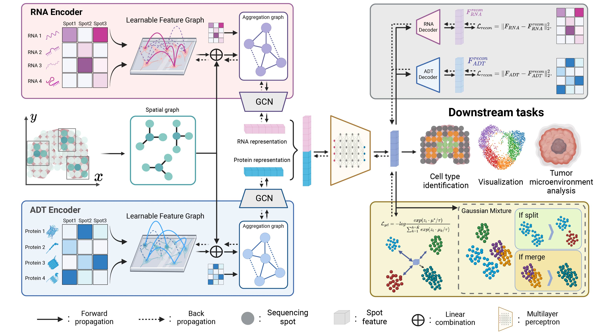

# PRAGA
A novel spatial multi-modal omics framework, named PRototype-Aware Graph Adaptative aggregation (PRAGA) for spatial multi-modal omics analysis.



## License
Part of the code is derived from SpatialGlue (Long et al. 2024).

## Dependencies
* python==3.8.19
* anndata==0.8.0
* numpy==1.22.3
* pandas==1.4.2
* rpy2==3.4.1
* scanpy==1.9.1
* scikit-learn==1.1.1
* scikit-misc==0.2.0
* scipy==1.8.1
* scvi==0.6.8
* torch==2.4.0 <br>

The above packages are the main packages used for the experiment, most 2.0+ torch environments can run the experiment directly, just in case we have provided a `./requirements.txt` file for all packages.  

## Data
Please download Human Lymph Node dataset (Long et al. 2024) and spatial epigenome–transcriptome mouse
brain dataset (Zhang et al. 2023) from https://zenodo.org/records/14591305, and unzip them into `./Data/`.

## Quick start

Use Anaconda to create a Python virtual environment. Here, we will create a Python 3.8 environment named praga:
```cmd
conda create -n praga python=3.8
conda activate praga
```
Install  packages:
```cmd
pip install -r requirements.txt
```

For Human Lymph Node dataset (Long et al. 2024), Spatial multi-modal
omics simulation datasets (Long et al. 2024) and spatial epigenome–transcriptome mouse
brain dataset (Zhang et al. 2023), you can directly execute the shell script commands:
```cmd
sh run.sh
```
The quantification results and visualizations will be saved in the `./results`.

## Applying PRAGA to Custom Datasets

To apply PRAGA to your own dataset, please ensure that the count matrices from different omics layers are stored in the anndata.AnnData format, and they share the same number of sequencing points and spatial coordinates. Then, you can run PRAGA by modifying the following command:

```cmd
python main.py --file_fold <Path to AnnData> --data_type <For customizing data preprocessing and training strategies> --n_clusters <Number of clusters for inference> --init_k <Estimated number of clusters for train> --KNN_k 20 --RNA_weight <reconstruction weigh of modal1> --ADT_weight <reconstruction weigh of modal2> --vis_out_path <Path to save visualizations, results/XXX.png> --txt_out_path <Path to save cluster labels, results/XXX.txt>
```

## Reference
[1] Long, Y.; Ang, K. S.; Sethi, R.; Liao, S.; Heng, Y.; van Olst, L.; Ye, S.; Zhong, C.; Xu, H.; Zhang, D.; et al. 2024. Deciphering spatial domains from spatial multi-omics with SpatialGlue. Nature Methods, 1–10.

[2] Zhang, D.; Deng, Y.; Kukanja, P.; Agirre, E.; Bartosovic, M.; Dong, M.; Ma, C.; Ma, S.; Su, G.; Bao, S.; et al. 2023. Spatial epigenome–transcriptome co-profiling of mammalian tissues. Nature, 616(7955): 113–122.
