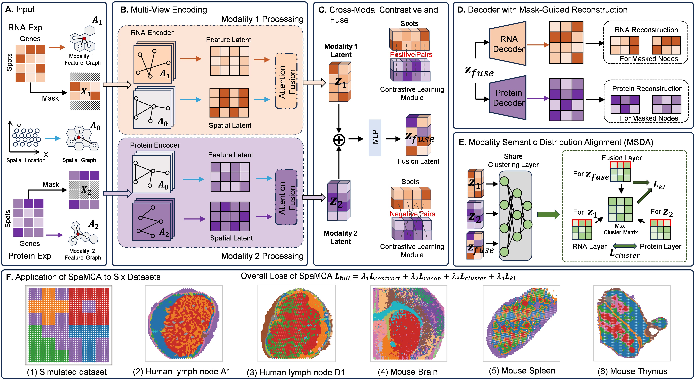

# SpaMCA

Recently, the rapid advancement of spatial multi-omics technologies, particularly the synergistic analysis of spatial transcriptomics and proteomics, has provided an unprecedented perspective for elucidating the spatial organization of tissue microenvironments and the complex landscape of cellular heterogeneity. 
However, clustering analysis of spatial multi-omics data remains in its infancy, primarily constrained by the inherent heterogeneity across modalities, technical noise introduced during sequencing, and the scarcity of reliable prior annotations.

To address these limitations, we propose **SpaMCA** (**Spa**tial **M**ulti-modal **C**lustering **A**nalysis),an unsupervised graph neural network framework designed to improve clustering performance and consistency across multi-modal data. Unlike conventional methods that process each modality independently, SpaMCA employs a dual-attention mechanism to collaboratively fuse spatial contextual information and omics-specific features, thereby enabling effective cross-omics integration and the capture of shared biological signals. The framework incorporates a masked graph autoencoder, which substantially enhances robustness to noise while preserving local spatial structures. Finally, a cluster-guided alignment module dynamically aligns the learned representations toward a high-confidence target distribution, further optimizing the quality of multi-omics data integration. 

We evaluated SpaMCA on five publicly available spatial multi-omics datasets and one simulated dataset, and conducted comprehensive comparisons against ten state-of-the-art single-omics and multi-omics clustering methods. Experimental results and ablation studies demonstrate that SpaMCA consistently outperforms existing approaches in terms of clustering accuracy, noise robustness, and the integration of heterogeneous omics modalities.
# OverView

## Installations
- NVIDIA GPU (a single Nvidia GeForce RTX 4090)
- `pip install -r requiremnt.txt`

## Data
All the datasets used in this paper can be downloaded from url：[https://zenodo.org/records/12800375](https://zenodo.org/records/17906891).

## Running demo
We provided codes for reproducing the experiments of the paper, and comprehensive tutorials for using SpaMCA. Please see `[Demo.ipynb]`. 

## Baselines
We have listed the sources of some representative baselines below, and we would like to express our gratitude to the authors of these baselines for their generous sharing.

- [MOFA+](https://github.com/bioFAM/MOFA) Uses a factor analysis framework combined with automatic relevance determination priors and sparse constraints to decouple shared and modality-specific variations, efficiently handling large-scale missing data in multi-omics.
- [PRAGA](https://github.com/Xubin-s-Lab/PRAGA): Constructs dynamic modality-specific graph structures that integrate spatial and feature information, introducing Bayesian Gaussian mixture prototype contrastive learning for adaptive clustering.
- [COSMOS](https://github.com/Lin-Xu-lab/COSMOS) Designs a dual-branch graph convolution encoder to represent different omics modalities, generating unified embeddings through weighted nearest neighbor fusion, contrastive learning, and spatial regularization.
- [SpatialGlue](https://github.com/JinmiaoChenLab/SpatialGlue): Designs dual attention mechanisms to capture intra-modal representations and cross-modal alignments, obtaining spatial-aware multi-omics representations by jointly optimizing reconstruction and correspondence losses.

## Acknowledgements
Part of the code in this repository, such as the training framework based on PyTorch Lightning, is adapted from [SpatialGlue](https://github.com/JinmiaoChenLab/SpatialGlue). 

## Contact details
If you have any questions, please contact zhaojinjie@aliyun.com and  minwenwen@ynu.edu.com.
