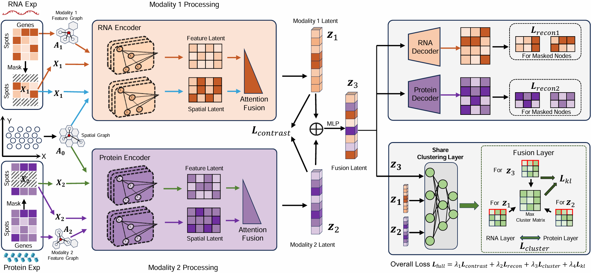

# SpaMCA

Recent advances in spatial omics technologies, particularly the integration of spatial transcriptomics and proteomics, offer unprecedented insights into tissue architecture and cellular heterogeneity. However, clustering in spatial multi-omics remains underdeveloped due to modality discrepancies, noise introduced during sequencing, and the absence of prior annotations.

To address these limitations, we propose **SpaMCA** (**Spa**tial **M**ulti-modal **C**lustering **A**nalysis), an unsupervised graph neural network framework designed to improve clustering performance and consistency across multi-modal data. Unlike conventional methods that treat each modality separately, SpaMCA integrates spatial and modality-specific features via a dual-attention mechanism, followed by cross-modal fusion to capture shared biological signals. A masked graph autoencoder preserves local structure and enhances robustness to noise. Finally, a clustering-guided alignment module improves integration quality by aligning representations to a high-confidence target distribution.

We evaluate SpaMCA on six publicly available multi-omics datasets, benchmarking it against ten competitive baseline methods. Experimental results and comprehensive ablation studies demonstrate that SpaMCA consistently outperforms these baselines in clustering accuracy, noise robustness, and the integration of heterogeneous omics modalities.
# OverView

## 🔬 Setup
-   `pip install -r requirement.txt`

## 🚀 Get Started
We provided codes for reproducing the experiments of the paper, and comprehensive tutorials for using SpaMCA.
- Please see `A1.ipynb`.
