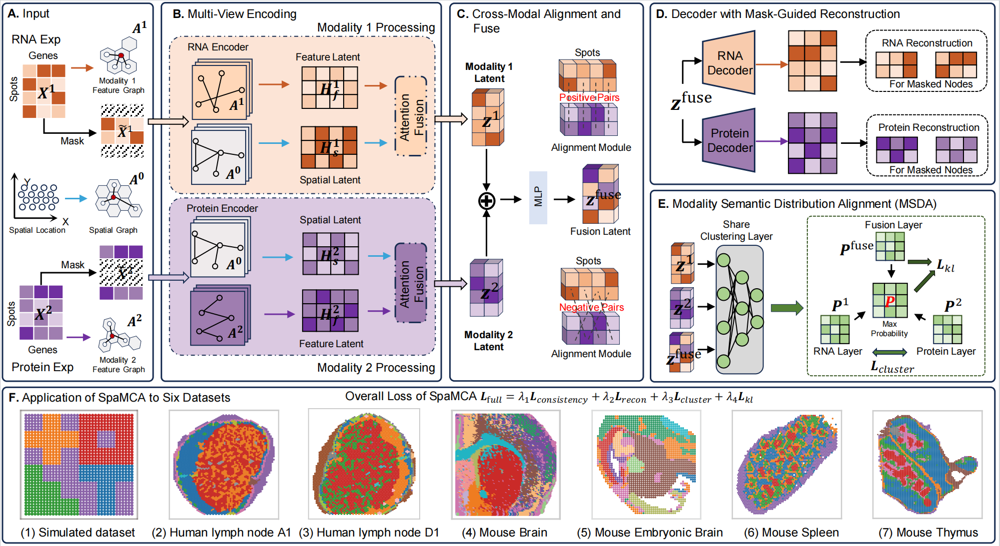

# SpaMCA

Recent advances in spatial omics, with joint spatial transcriptomic and proteomic profiling, create unprecedented opportunities to investigate tissue architecture and cellular heterogeneity. However, robust clustering of spatial multi-omics data remains challenging due to pronounced cross-modality heterogeneity, pervasive technical noise, and the lack of reliable prior annotations. 

To address these challenges, we propose **SpaMCA** (**Spa**tial **M**ulti-modal **C**lustering **A**nalysis), a multi-view masked graph neural network framework. SpaMCA performs modality-specific representation learning using a multi-view masked graph autoencoder that jointly models spatial neighborhood graphs and feature similarity graphs, thereby enhancing robustness to noise while preserving local spatial structures. Within each modality, SpaMCA employs an attention-based mechanism to fuse the spatial and feature views. To capture shared biological signals across heterogeneous modalities, SpaMCA further introduces a cross-modal alignment objective, followed by a multilayer perceptron to integrate complementary information into a unified latent representation.

Finally, a modality semantic distribution alignment module is incorporated at the clustering level to dynamically align modality-specific and fused representations toward a high-confidence target distribution. We evaluate SpaMCA on seven spatial multi-omics datasets, including six real-world datasets and one simulated benchmark, and compare it with ten state-of-the-art single-omics and multi-omics clustering methods. Experimental results and ablation studies demonstrate that SpaMCA consistently outperforms existing approaches in terms of clustering accuracy, robustness to noise, and effective integration of heterogeneous omics modalities.
# OverView

## Installations
- NVIDIA GPU (a single Nvidia GeForce RTX 4090)
- `pip install -r requiremnt.txt`

## Data
All the datasets used in this paper can be downloaded from url：[https://zenodo.org/records/12800375](https://zenodo.org/records/17906891).

## Running demo
We provided codes for reproducing the experiments of the paper, and comprehensive tutorials for using SpaMCA. Please see `[Demo.ipynb]`. 

## Baselines
We have listed the sources of some representative baselines below, and we would like to express our gratitude to the authors of these baselines for their generous sharing.

- [MOFA+](https://github.com/bioFAM/MOFA) Uses a factor analysis framework combined with automatic relevance determination priors and sparse constraints to decouple shared and modality-specific variations, efficiently handling large-scale missing data in multi-omics.
- [PRAGA](https://github.com/Xubin-s-Lab/PRAGA): Constructs dynamic modality-specific graph structures that integrate spatial and feature information, introducing Bayesian Gaussian mixture prototype contrastive learning for adaptive clustering.
- [COSMOS](https://github.com/Lin-Xu-lab/COSMOS) Designs a dual-branch graph convolution encoder to represent different omics modalities, generating unified embeddings through weighted nearest neighbor fusion, contrastive learning, and spatial regularization.
- [SpatialGlue](https://github.com/JinmiaoChenLab/SpatialGlue): Designs dual attention mechanisms to capture intra-modal representations and cross-modal alignments, obtaining spatial-aware multi-omics representations by jointly optimizing reconstruction and correspondence losses.

## Acknowledgements
Part of the code in this repository, such as the training framework based on PyTorch Lightning, is adapted from [SpatialGlue](https://github.com/JinmiaoChenLab/SpatialGlue). 

## Contact details
If you have any questions, please contact zhaojinjie@aliyun.com and  minwenwen@ynu.edu.com.
